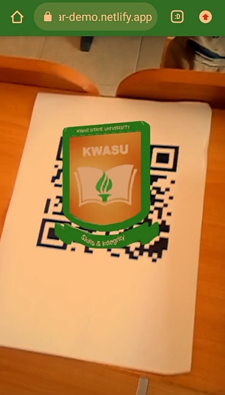
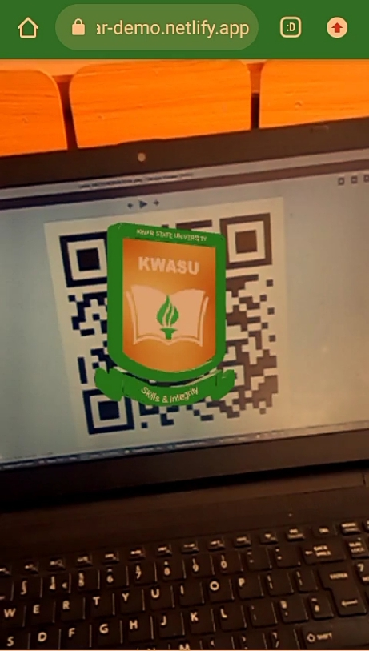

# KwasuAR Demo

This is just a proof of concept ar demo using QRCode as marker

[View Live :rocket:](https://kwasu-ar-demo.netlify.app/#/qrscan)

Currently, any QRCode can be used as marker but. You can also use the QRCode below


## Screenshots




## Developmet Setup

Just the basics, clone the repo the

```bash
npm install
```

and

```bash
npm run dev
```

## Building

Perform development setup then

```bash
npm run build
```
